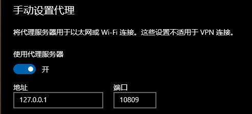

# :memo: nonebot_plugin_zyk_novelai

**基于4chan魔改版NovelAILeaks(naifu)制作（基础版，功能后面会陆续加上）**

## 安装方式
- #### 使用pip
```
pip install nonebot_plugin_zyk_novelai
```
- #### 使用nb-cli
```
nb plugin install nonebot_plugin_zyk_novelai
```
:ambulance: :beer:
>**因为我PYPI版本提交的问题，所以安装过老版本的需要删除后重新下一遍，不然无法安装最新版**

## :rocket: 配置后端（Colab部署）
1. 后端配置地址：[配置后端](https://colab.research.google.com/drive/1_Ma71L6uGbtt6UQyA3FjqW2lcZ5Bjck-)
   - 配置需要**科学上网**（大陆无法访问Colab）和**谷歌账号**

2. 请按照要求配置好后在**env**中填写生成的URL或*使用指令发送给机器人*
   - 注意，url格式通常为：`https://THIS-IS-A-SAMPLE.trycloudflare.com/` **末尾的斜杠“/”不能少！**

3. 请在**env**中填写代理使用的的本地端口*或使用指令发送给机器人*，并确保开着代理，不然可能发送不了请求 *（报EOF相关的错误）*

## :wrench: env配置

|        Name        |                    Example                    | Type |  Usage   |
|:------------------:|:---------------------------------------------:|:----:|:--------:|
|  novelai_post_url  | `https://THIS-IS-A-SAMPLE.trycloudflare.com/` | str  |  后端URL   |
| novelai_proxy_port |                     10809                     | int  |  本地代理端口  |

## :label: 指令
##### :clown_face: *不愿意看的可以直接去看源码*

- #### 查看当前配置信息
```
check state
```

- #### 设置后端URL
```
set_url:https://THIS-IS-A-SAMPLE.trycloudflare.com/
```

- #### 设置本地代理端口
```
set_port:10809
```

>#### 附
> 无代理模式
> ```
> set_port:None
> ```
> **注意，None开头为大写**

- #### 普通绘图
```
ai绘图 | AI绘图 | ai作图 | AI作图 size= prompt=

例：
   ai绘图 size=512x512 prompt={solo}, {{masterpiece}}, {{best quality}}, finely detail, meticulous painting
```

- #### 以图生图

和普通生图指令基本一样
```
以图生图 | img2img [your image] size= prompt=
```

>#### 附
>
>随机prompt
>
>*以图生图和普通模式都可以使用*
>```
>prompt=RandomP 条数
>
>例：
>   ai绘图 size=512x512 prompt=RandomP 10
>```
>提一句，由于数据库里的tag太水了，所以随机的prompt要做好心理准备......

- #### 搜索魔咒
```
(COMMAND_START)补魔 | 召唤魔咒 | 搜索魔咒 中文名

例：
   /补魔 黑发
```

## :egg: 补充
>什么是本地代理端口？

可能有人不明白什么是本地代理端口（也有可能是我的措辞问题），这里提一下

本地代理端口指的就是你的**代理软件**所使用的（系统）端口

不知道本地代理端口在哪里的可以看这里 *（以Windows 10 为例）*



其中的**端口**即你的本地代理端口