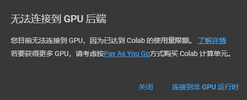

# :memo: nonebot_plugin_zyk_novelai

*本插件基于Naifu端配置制作*

*:page_facing_up: 使用本插件前请仔细阅读README文档*

## :sparkles: 新版本一览
### :pushpin: version 2.9.2
>都更新了哪些内容？
1. 以图生图不加size参数自动选择尺寸
2. 添加生图时间自定义功能

### :chart_with_upwards_trend: 预计未来更新的内容
1. 添加用户CD冷却时间功能
3. 添加消息撤回功能
4. 更新tag数据库


## 安装方式
- #### 使用pip
```
pip install nonebot_plugin_zyk_novelai
```
- #### 使用nb-cli
```
nb plugin install nonebot_plugin_zyk_novelai
```
:ambulance: :beer:
>**因为我PYPI版本提交的问题，所以安装过老版本的需要删除后重新下一遍，不然无法安装最新版**

## :rocket: 配置后端（Colab部署）
1. 使用4chan魔改版NovelAILeaks(naifu)的Colab后端：[配置后端](https://colab.research.google.com/drive/1_Ma71L6uGbtt6UQyA3FjqW2lcZ5Bjck-)
   - 配置需要**科学上网**（大陆无法访问Colab）和**谷歌账户**

2. 请按照要求配置好后在**env**中填写生成的URL或*使用指令发送给机器人*
   - 注意，URL格式通常为：`https://THIS-IS-A-SAMPLE.trycloudflare.com/` **注意在末尾加上斜杠“/”！**

   

3. 发送请求报错：（报EOF相关的错误）
   - 请在**env**中填写代理使用的的本地代理端口*或使用指令发送给机器人*，并确保开着代理

5. Colab端无法配置：普通谷歌账户使用Colab会有GPU使用时限。解决方法：
   - 等一段时间，一般半天或一天就会恢复使用
   - 多开几个谷歌账户轮流使用，重复步骤一
   - 付费购买或订阅
   - 使用本地版Naifu，需要NVIDIA显卡

   

## :wrench: env配置

|        Name        |                    Example                    |    Type    | Usage  |
|:------------------:|:---------------------------------------------:|:----------:|:------:|
|  novelai_post_url  | `https://THIS-IS-A-SAMPLE.trycloudflare.com/` |    str     | 后端URL  |
| novelai_proxy_port |                     10809                     | int or str | 本地代理端口 |
|  novelai_img_time  |                      20                       | int or str | 生图时间限制 |

## :label: 指令

### 查看当前配置信息
```
check state
```

### 设置后端URL
```
set_url:https://THIS-IS-A-SAMPLE.trycloudflare.com/
```
或直接在env配置文件中填写
```
novelai_post_url=https://THIS-IS-A-SAMPLE.trycloudflare.com/
```

### 设置本地代理端口
```
set_port:10809
```
或直接在env配置文件中填写
```
novelai_proxy_port=10809
```

- #### *无代理模式*
```
set_port:None
```
或直接在env配置文件中填写
```
novelai_proxy_port=None
```
**注意，None开头为大写**

### 设置生图时间限制
```
set_time:20
```
或直接在env配置文件中填写
```
img_time=20
```
- #### *无限制模式*
```
img_time:None
```
或直接在env配置文件中填写
```
img_time=None
```
**注意，None开头为大写**

### 普通绘图
```
ai绘图 | AI绘图 | ai作图 | AI作图 [scale=] [steps=] [size=] [seed=] [prompt=] [uc=]

例：
   ai绘图 steps=50 prompt={masterpiece}, best quality, {1 girl with black long hair and {{red light eyes}} wearing white dress and white leggings}, {loli:2}, full body, {sitting in sofa}, {looking at viewer} AND {dislike and void}, dark background
```

- #### *随机prompt指令参数*

*以图生图和普通模式都可以使用*
1. 不加*prompt参数*默认使用随机prompt，当然tag个数也将随机
2. 使用*随机prompt指令参数*指定tag个数

   ```
   prompt=RandomP (num)
     
   例：
      prompt=RandomP 30
   ```

### 以图生图

和普通生图指令基本一样
```
以图生图 | img2img (your image) [strength=] [noise=] [scale=] [size=] [seed=] [prompt=] [uc=]

例：
   img2img (an image) strength=0.5 noise=0.4 size=1024x512
```

- #### :book: 附参数说明

更详细的参数说明见后文

参数strength和noise都是一个*float（浮点）* 类型的数，且应 **<=0.99**

### 搜索魔咒
```
(COMMAND_START)补魔 | 召唤魔咒 | 搜索魔咒 中文名

例：
   /补魔 黑发
```

## :bulb: 生图指令参数说明
#### *在使用生图指令时，请严格规范指令格式（参数位置），否则无法触发响应*
### 参数支持
普通生图指令支持参数：
- [x] scale *（可选）* 默认**12**
- [x] steps *（可选）* 默认**28**
- [x] seed *（可选）* 默认**随机**
- [x] size *（可选）* 默认**512x768**
- [x] uc *（可选）* 默认 **...**（由于过长，此处省略）
- [x] prompt *（可选）* 默认**随机**

以图生图指令支持参数：
- [x] size *（可选）* 默认**按原图尺寸匹配**
- [x] strength *（可选）* 默认**0.7**
- [x] noise *（可选）* 默认**0.2**
- [x] scale *（可选）* 默认**12**
- [x] seed *（可选）* 默认**随机**
- [x] uc *（可选）* 默认 **...**（由于过长，此处省略）
- [x] prompt *（可选）* 默认**随机**

### :page_with_curl: 参数解释
- **scale**：在高scale下，提示将更紧密地遵循，细节和清晰度更高。低scale通常会导致更大的创作自由度，但清晰度降低

- **steps**：优化图像的迭代次数

- **seed**：图像种子

- **size**：图像尺寸

- **strength**：控制上传图像的更改量。较低的强度将生成更接近原始图像的图像

- **noise**：较高的噪点会增加添加到上传图像的细节，但如果太高，则会导致伪影。通常，噪声应始终小于强度

- **uc**：不需要的内容

## :egg: 补充
>:question: 什么是本地代理端口？

本地代理端口指的就是你的**代理软件**所使用的（系统）端口

如何查看本地代理端口？ *（以Windows 10 为例）*


其中的**端口**即你的本地代理端口

>Naifu的正确食用姿势

[Naifu魔咒咏唱：从入门到入土](https://github.com/ZYKsslm/Summoning-Magic-of-Naifu)

---
:bug: 如果发现插件有BUG或有建议，欢迎**合理**提*Issue*

:heart: 最后，如果你喜欢本插件，就请给本插件点个:star:吧